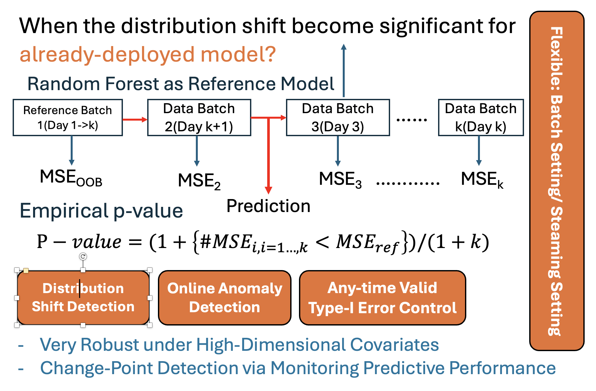

This implements the online extension for the hypothesis testing of the
distribution shift.

The benchmark methods include --- Leverage from the bayesian online
change-point detection:
<https://github.com/hildensia/bayesian_changepoint_detection> 
[1] BOCPD(Bayesian Online Change-Point Detection) --- Leverage from the frouous packages: <https://github.com/IFCA-Advanced-Computing/frouros> for online concept drift detection  \\ 
[2] DDM: Data detection method \\
[3] STEPD: Statistical Test of Equal Proportions Detection \\
[4] HDDMA: Hoeffding Drift Detection Method using Moving Average \\
[5] ECDDWT: EWMA Concept Drift Detection Warning \\
[6] Page-Hinkley: The page-hinkley method for online anomaly detection \\
---- Leverage the SKM methodologies here: \\
[7] SKM_KSWIN: Detect change and keeping updated statistics \\
[8] SKM_ADWIN: Detect change and keeping updated statistics through the adaptive windows \\
[9] HalfSpaceTrees: Online Anomaly Detection methods via the Half-Space Trees \\
[10] TwoSample: Online Two-sample testing procedure \\ 
---- 11, 12 leverages the martingale based/e-value
based procedure [11] Martingale based procedure: Conformal Martingale
based Procedure [12] E-value based procedure: ---- 13, 14 leverages the
online FDR control procedure with the enhanced [13] SAFFRON: Adaptive
[14] ADDIS: Adaptive Discarding for the conservative Nulls ---- 15, 16
leverages the asynchronous online multiple testing procedures [15]
SAFFRON async: Asynchronous SAFFRON procedure with overlap between the
neighboring batches [16] ADDIS async: Asynchronous ADDIS procedure with
overlap between the neighboring batches

------------------------------------------------------------------------

#The diagram for the illustration of this algorithm:

```{r, echo=FALSE, out.width="50%", fig.align="center", fig.cap="Your Caption"}

```


#The prototype for the python:
```python 
!pip install 
from benchmark_config import MODEL_REGISTRY
from onlineRFPerm import onlinePermOOB
#Generate the stationary data for the null-distribution:

```

#The prototype for R:
```R
#Simulating the Stationary Data-Generating Process, should reject nothing via the OnlineFDR procedure.
set.seed(2026)
df_X <- matrix(rnorm(10000, 0, 1), nrow = 1000, ncol = 10)
df_Y <- rnorm(1000)
df_input <- data.frame(cbind(df_X, df_Y))
colnames(df_input) <- c(paste("X", c(1:ncol(df_X)), sep = "_"), "y") #rename the last(response) column as y
rf_spec <- rand_forest(mtry = 5, trees = 100) %>%
  set_engine('ranger', importance = 'impurity') %>%
  set_mode('regression')
onlinePermOOB_regression_prototype(df_input, rf_spec, 
  ref_batch_size = 200, batch_size = 5, method_p = 'Unweighted',
   burnin = 0, train_prop = 0.6)
- Did not reject anything here via the OnlineFDR procedure but for the fixed alpha procedure, do generate some rejections.
$start_ind1_addis
[1] NA
$start_ind2_addis
[1] NA
$start_ind3_addis
[1] NA
$start_ind1_saffron
[1] NA
$start_ind2_saffron
[1] NA
$start_ind3_saffron
[1] NA
$start_ind1_fix
[1] 24
$start_ind2_fix
[1] 248
$start_ind3_fix
[1] 314
```


