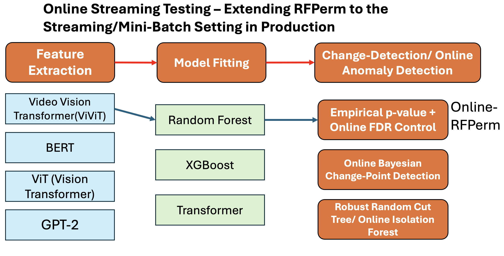
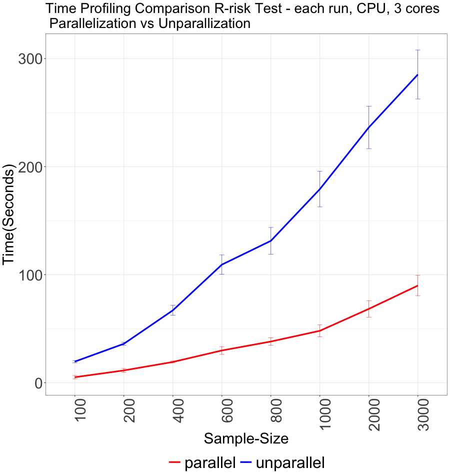

### This implements the online extension for the hypothesis testing of the distribution shift - OnlineRFPerm

The benchmark methods include --- Leverage from the bayesian online
change-point detection:
<https://github.com/hildensia/bayesian_changepoint_detection> \\
[1] BOCPD(Bayesian Online Change-Point Detection) --- Leverage from the frouous packages: <https://github.com/IFCA-Advanced-Computing/frouros> for online concept drift detection  \\ 
[2] DDM: Data detection method \\
[3] STEPD: Statistical Test of Equal Proportions Detection \
[4] HDDMA: Hoeffding Drift Detection Method using Moving Average \
[5] ECDDWT: EWMA Concept Drift Detection Warning \\
[6] Page-Hinkley: The page-hinkley method for online anomaly detection \\
---- Leverage the SKM methodologies here: \\
[7] SKM_KSWIN: Detect change and keeping updated statistics \\
[8] SKM_ADWIN: Detect change and keeping updated statistics through the adaptive windows \\
[9] HalfSpaceTrees: Online Anomaly Detection methods via the Half-Space Trees \\
[10] TwoSample: Online Two-sample testing procedure \\ 
---- 11, 12 leverages the martingale based/e-value based procedure \\
[11] Martingale based procedure: Conformal Martingale based Procedure \\
[12] E-value based procedure: Online Anomaly Detection via E-values(https://arxiv.org/abs/2410.23614) \\
---- 13, 14 leverages the online FDR control procedure with the enhanced timely detection with reduced computational complexity. \\\
[13] SAFFRON: Adaptive online FDR control method. \\ 
[14] ADDIS: Adaptive Discarding for the conservative Nulls. \\
---- 15, 16 leverages the asynchronous online multiple testing procedures. \\
[15] SAFFRON async: Asynchronous SAFFRON procedure with overlap between the neighboring batches. \\ 
[16] ADDIS async: Asynchronous ADDIS procedure with overlap between the neighboring batches. \\

------------------------------------------------------------------------

#The diagram for the illustration of this algorithm:

```{r, echo=FALSE, out.width="50%", fig.align="center", fig.cap="Your Caption"}
knitr::include_graphics("utils/onlinePermOOB_diagram.png")
```


### Modality Agnostic Nature of this procedure 
The proposed methodology possess very high flexibility with the model agnostic procedure with extensions on a wide variety of types of datasets, ranging from the image data, text data, video data, audio data as well as the motion planning dataset.

```{r, echo=FALSE, out.width="50%", fig.align="center", fig.cap="Your Caption"}

```

Via proper parallelization the computational cost can be reduced by 60\% - 70\%.
```{r, echo=FALSE, out.width="50%", fig.align="center", fig.cap="Your Caption"}

```


### The prototype for the python via the Stationary DGP - should yield no rejection properly
```python 
!pip install
from benchmark_config import MODEL_REGISTRY
from onlineRFPerm import onlinePermOOB
from FineTuneBaseline
#Generate the stationary data for the null-distribution:
model_factory = ModelRegistry(
ntree = 150, ridge_alpha = 0.25,
nthread = 1, maxit = 500,
max_depth = 5, gamma = 0.25,
eta = 0.15, mlp_hidden_size = 4,
mlp_decay = 1e-4, mlp_max_iter = 500)
MODEL_REGISTRY = model_factory.as_r_style_dict()
from itertools import product
REF_BATCH_LIST = [500, 1000, 1500, 2500]
BATCH_SIZE_LIST = [1, 10, 25, 50]
B = 2
#The columns for all of the benchmark methods with varying batch-sizes and the reference-batch sizes.
cols = ['BOCPD_SUM', 'BOCPD_bcpd_2', 'BOCPD_bcpd_1', 'BOCPD_bcpd_3', 'EWMA_SUM', 'EWMA_3', 'EWMA_2', 'EWMA_1', 
'TS_SUM', 'TS_3', 'TS_2', 'TS_1', 'ADWIN_SUM', 'ADWIN_3', 'ADWIN_2', 'ADWIN_1', 'HDMMA_SUM', 'HDMMA_3', 'HDMMA_2', 'HDMMA_1', 'ECDDWT_SUM', 'ECDDWT_3', 'ECDDWT_2', 'HalfSpaceTrees_SUM', 'HalfSpaceTrees_1', 'HalfSpaceTrees_2', 'HalfSpaceTrees_3', 'martingale_SUM', 'martingale2_SUM', 'martingale_1', 'martingale_2', 'martingale_3', 'martingale2_1', 'martingale2_2', 'martingale2_3', 'fix_SUM', 'fix_1', 'fix_2', 
'fix_3', 'addis_SUM', 'addis_1', 'addis_2', 'addis_3', 'saffron_SUM',
 'saffron_1', 'saffron_2', 'saffron_3', 'DDM_SUM', 'DDM_1', 'DDM_2', 
 'DDM_3', 'STEPD_SUM', 'STEPD_1', 'STEPD_2', 'STEPD_3', 'HDDMA_SUM',
  'HDDMA_1', 'HDDMA_2', 'HDDMA_3', 'ECDDWT_1', 'name', 'ref_batch_size', 'batch_size']
for ref_batch_size, batch_size in product(REF_BATCH_LIST, BATCH_SIZE_LIST):
    result = []
    for i in range(B): 
        np.random.seed(i)
        df_whole = Mars(7000, p_nuisance = 25, sigma = 1, eps_noi = 1, seed = i ** 2)
        result_mlp = onlinePermOOB_wholedf(df_whole,
            model_registry = MODEL_REGISTRY,
            model_m = 'mlp_regressor',
            ref_batch_size = ref_batch_size,
            batch_size = batch_size,
            seed = 2026 + i)
        result_mlp['name'] = 'mlp'
        result_mlp['ref_batch_size'] = ref_batch_size
        result_mlp['batch_size'] = batch_size
        result.append(result_mlp)
        result_rf = onlinePermOOB_wholedf(df_whole,
            model_registry = MODEL_REGISTRY,
            model_m = 'rf_regressor',
            ref_batch_size = ref_batch_size,
            batch_size = batch_size,
            seed = 2026 + i)
        result_rf['name'] = 'rf'
        result_rf['ref_batch_size'] = ref_batch_size
        result_rf['batch_size'] = batch_size
        result.append(result_rf)
        result_xgb = onlinePermOOB_wholedf(df_whole,
            model_registry = MODEL_REGISTRY,
            model_m = 'xgb_regressor',
            ref_batch_size = ref_batch_size,
            batch_size = batch_size,
            seed = 2026 + i)
        result_xgb['name'] = 'xgb'
        result_xgb['ref_batch_size'] = ref_batch_size
        result_xgb['batch_size'] = batch_size
        result.append(result_xgb)
        pd.DataFrame(result).to_csv(f"FineTune_Baseline/{ref_batch_size}_{batch_size}_xgb_detection_NLM.csv")
```

### The prototype for R:
```R
#Simulating the Stationary Data-Generating Process, should reject nothing via the OnlineFDR procedure.
set.seed(2026)
df_X <- matrix(rnorm(10000, 0, 1), nrow = 1000, ncol = 10)
df_Y <- rnorm(1000)
df_input <- data.frame(cbind(df_X, df_Y))
colnames(df_input) <- c(paste("X", c(1:ncol(df_X)), sep = "_"), "y") #rename the last(response) column as y
rf_spec <- rand_forest(mtry = 5, trees = 100) %>%
  set_engine('ranger', importance = 'impurity') %>%
  set_mode('regression')
onlinePermOOB_regression_prototype(df_input, rf_spec, 
  ref_batch_size = 200, batch_size = 5, method_p = 'Unweighted',
   burnin = 0, train_prop = 0.6)
- Did not reject anything here via the OnlineFDR procedure but for the fixed alpha procedure, do generate some rejections.
$start_ind1_addis
[1] NA
$start_ind2_addis
[1] NA
$start_ind3_addis
[1] NA
$start_ind1_saffron
[1] NA
$start_ind2_saffron
[1] NA
$start_ind3_saffron
[1] NA
$start_ind1_fix
[1] 24
$start_ind2_fix
[1] 248
$start_ind3_fix
[1] 314
```


